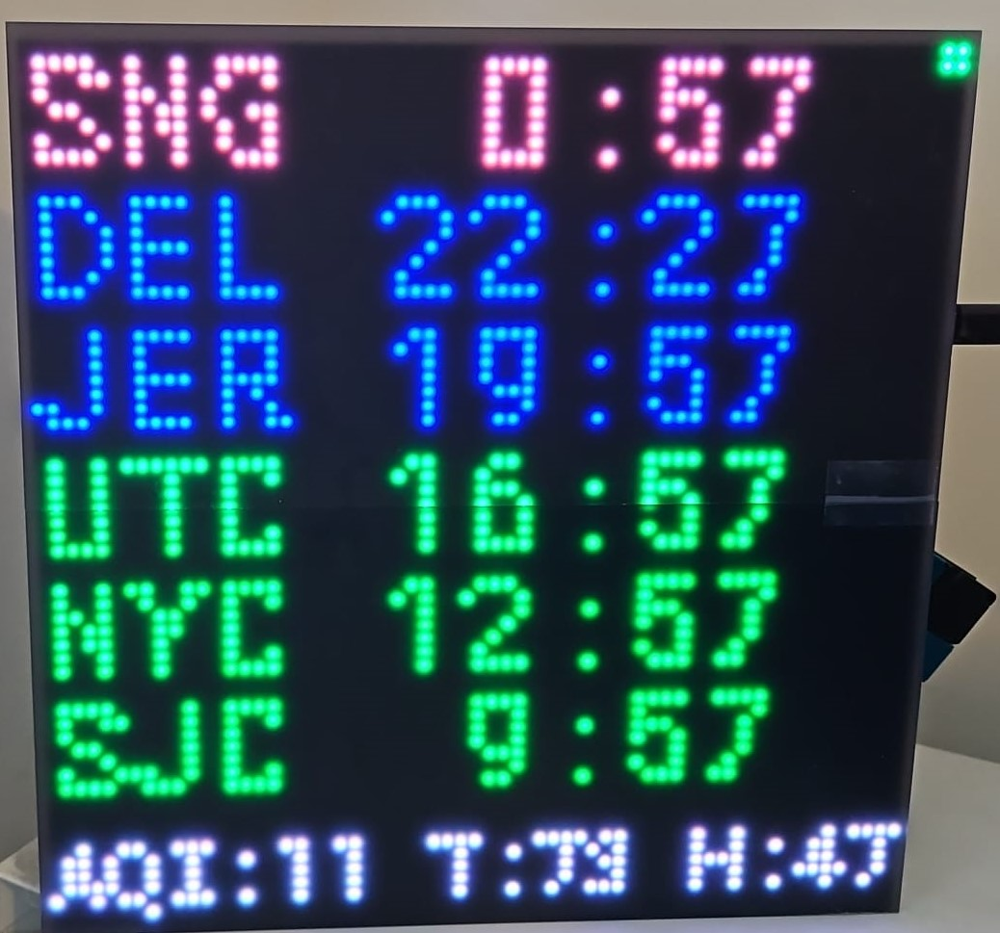

# Matrix World Clock

Display world clock on a 64 * 64 RGM matrix using two 64*32 matrixes, sync with time source from the Internet.
Using CirtcuitPython

## Picture


## material
- [matrix Portal](https://www.adafruit.com/product/4745)
- [2 x 64 * 32 LED Matrix](https://www.adafruit.com/product/2278)
- [Air quality sensor](https://www.adafruit.com/product/4632)
- [Temp and Humidity sensor](https://www.adafruit.com/product/4566)
- USB power suply and STEMAQT short cables
- [2 x Defuser](https://www.adafruit.com/product/4594)

## Guide used
- [Matrix Portal](https://learn.adafruit.com/adafruit-matrixportal-m4/overview)
- [Matrix Chaining](https://learn.adafruit.com/rgb-led-matrices-matrix-panels-with-circuitpython/advanced-multiple-panels)
- [Display IO](https://learn.adafruit.com/circuitpython-display-support-using-displayio)

## Note
To connect to WiFi, add a file named `secrets.py` to the root directory with the following content:
```python
secrets = {
        'ssid' : 'SSID',
        'password' : 'WifiPassword',
}
```
